```mermaid

graph TD
    User["👤 User"] -->|Logs activity & sets goals| Frontend["🖥️ Frontend (Web Framework)"]
    
    Frontend -->|API Calls| Backend["🖥️ Backend (Python)"]
    Backend -->|Stores & Retrieves Data| Database["🛢️ Relational Database"]

    Backend -->|Updates & Fetches| Leaderboard["🏆 Leaderboard"]
    Backend -->|Handles Authentication| AuthService["🔐 Auth Service (OAuth/Hashed Passwords)"]

    Frontend -->|Fetches Leaderboard Data| Leaderboard

    Backend -->|Sends Notifications| NotificationService["📢 Notification Service"]
    Backend -->|Integrates with External APIs| ExternalAPIs["🌍 Health APIs (e.g., Fitbit, Apple Health)"]


```

# <p align="center">Capstone</p>

## <p align="center">Summary</p>
Our Health and Wellness Tracker App enables users to log their food and water intake, workouts, and sleep. 
Users can set and track personal wellness goals, participate in community events, and share their progress with others. 
Our team will deliver a dynamic yet user-friendly experience by utilizing a web-based front end and a Python-powered backend.

---
## <p align="center">Setup Instructions</p>

### 1. Clone The Repository
```
git clone https://github.com/LoganPickell/Capstone.git
```
### 2. Create a Virtual Environment (Optional/Recommended, not required)
```
python -m venv venv
```
### 3. Install Dependencies
```
pip install -r requirements.txt
```
### 4. Change Directories
```
cd capstoneproject
```
### 5. Fix .env file
Use the following command in the terminal to copy .env.sample into a .env file.
```
cp capstoneproject/.env.sample capstoneproject/.env
```
Change the variable DJANGO_SECRET_KEY to a value with 10-15 random characters.
Save the file.

In the file in 'capstoneproject/capstoneproject/.env' add the following at the bottom:
```
DB_USER=collaborator
DB_PASSWORD=CollabPW321!
```

### 6. Run Server
```
python manage.py runserver
```
### 7. Are you on a MAC? Getting a MYSQL Error?
This error occurs because macOS does not come with MySQL development headers by default, which are required to install mysqlclient (the underlying library that Django’s MySQL backend uses).
Windows often handles this differently due to bundled MySQL support in some environments.

Use the following commands to fix the error
```
brew install pkg-config
brew install mysql-client
pip install mysql
```
### 8. Access the App
Once the server is running, see terminal for link to port to enter in your browser.

---


## <p align="center">Entity Relationship Diagram </p>


---

## <p align="center">User Flow Diagram</p>

---

## <p align="center">System Architecture Diagram</p>

