```mermaid

graph TD
    User["👤 User"] -->|Logs activity & sets goals| Frontend["🖥️ Frontend (Web Framework)"]
    
    Frontend -->|API Calls| Backend["🖥️ Backend (Python)"]
    Backend -->|Stores & Retrieves Data| Database["🛢️ Relational Database"]

    Backend -->|Updates & Fetches| Leaderboard["🏆 Live Leaderboard"]
    Backend -->|Handles Authentication| AuthService["🔐 Auth Service (OAuth/Hashed Passwords)"]

    Frontend -->|Fetches Leaderboard Data| Leaderboard

    Backend -->|Sends Notifications| NotificationService["📢 Notification Service"]
    Backend -->|Integrates with External APIs| ExternalAPIs["🌍 Health APIs (e.g., Fitbit, Apple Health)"]


```

# 
Capstone

## 
Summary

Our Health and Wellness Tracker App enables users to log their food and water intake, workouts, and sleep. 
Users can set and track personal wellness goals, participate in community events, and share their progress with others. 
Our team will deliver a dynamic yet user-friendly experience by utilizing a web-based front end and a Python-powered backend.

## 
Entity Relationship Diagram 

---

## 
User Flow Diagram

---

## 
System Architecture Diagram

